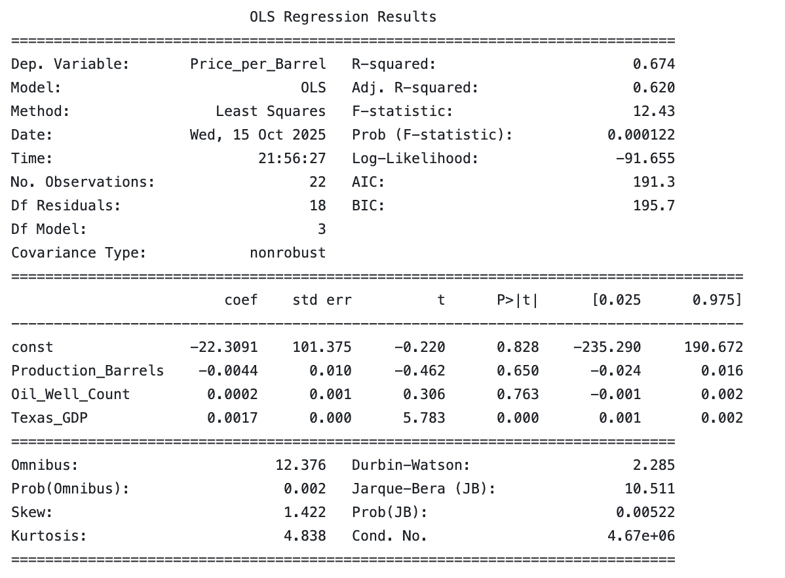

# Texas-Oil-Project
Oil Production Midterm Project

## Project Overview
This project investigates how **Texas oil prices** have impacted **Texas oil production** - measured by well counts and barrel production.  
We scarped data on our individual variables to create a combined dataset to study production trends, economic cycles and potential casual relationships between production activity and the broader economic preformance. 
We utilized regression analysis and a time-series technique to identify whether increases in oil output or well counts are associated with changes in oil prices.

### Research Questions
* How have Texas oil well counts and production levels evolved over time? 
* Is there a measurable relationship between oil production and oil prices?
* How does oil productivty or activity correlate with Texas GDP?  
* How responsive is Texas oil production to changes in price? 

## Data Sources
- **Well Counts** | Annual Texas oil well counts since 1935 | [Texas Railroad Commision](https://www.rrc.texas.gov/oil-and-gas/research-and-statistics/production-data/historical-production-data/crude-oil-production-and-well-counts-since-1935/)
- **Oil Production (Barrels)** | Monthly field production of crude oil in Texas | [US Energy Information Administration](https://www.eia.gov/dnav/pet/hist/LeafHandler.ashx?n=PET&s=MCRFPTX2&f=M)
- **Texas GDP** | Annual State GDP | [FRED - NGSP](https://fred.stlouisfed.org/graph/?g=hz8p)
- **Oil Prices** | Texas Crude Oil First Purchase Price (dollars per barrel) | [US Energy Information Administration](https://www.eia.gov/dnav/pet/hist/LeafHandler.ashx?n=PET&s=F003048__3&f=M)    
### Data Collection 
All data (raw) is stored in the '/artifacts' folder. We cleaned and merged the datasets to ensure consistenty among:
- Units (thousand of barrels to barrels)
- Observation Frequency - inconsistent/missing years in data
- Date Alignment (time frequency) to ensure annual observations

## Methodology
We estimate the relationships through a regression model(s):
Price_per_Barrel 
## Regression Results 

- 2 global major oil market events are noticeable above:
    1. The Great Recession (2008-2009) where we can see oil prices (actual) plumment after reaching record-high prices in icnreasing from 2004-2008.
    2. The oil price crash (2014-2016) when OPEC decided to push productivty in oil and increases output, despite the fact that prices were already falling. This lead to overproduction and a massive supply gult, and prices continued to plumment.   
     

## Analysis
Regression Results 
- **R-squared** = 0.674 | 67.4% of the variation in oil prices can be explained in our model.
- **Texas_GDP** is the only variable in the model that has a statistical significance with (p = .000)
    - However, this may be due to ????
- **Oil_Well_Count** and **Production_Barrels** are not statistically significant in this model. 

## Discussion
### Limitations 
- Data frequency 
Our data is mainly annual, but monthly or quarterly data for all variables could potentially better capture price production dynamics.
-  Omitted Variables
Oil prices are impacted by many other factors from outside of Texas, including global factors such as OPEC decisions.
- Regional Variation 
Oil activity varies widely across Texas. Using only state-level averages can potentially hide any important regional differences that could be better seen with county-level data. 

### Next Steps (extensions)
1. Regional or County-Level Analysis:
    - Use county-level data to analyze any regional variation.
    - Examine if regions that are richer in Oil like Midland experience different price elasticities compared to less active regions. 
    - Look into more regional economic factors such as regional population.
2. Comparative Analysis:
    - Compare Texas to another major oil-producing state (e.g. New Mexico or North Dakota).
3. Corporate Analysis:
    - Explore data from major oil producers operating in Texas (e.g. ExxonMobil, Chevron, ConocoPhillips).
    - Examine firm-level production trends and whether they correlate with market prices.

## Reproduction
1. Clone the repository `git clone git@github.com:bradleyvance23/Texas-Oil-Project.git`
2. Install additional packages `pip install -r requirements`
3. Run data visualization file  `python code/data_visualization.py`
    - This file will run the scraping file, data cleaning file, and the data analysis file
4. View the outputs in the `artifacts` folder

