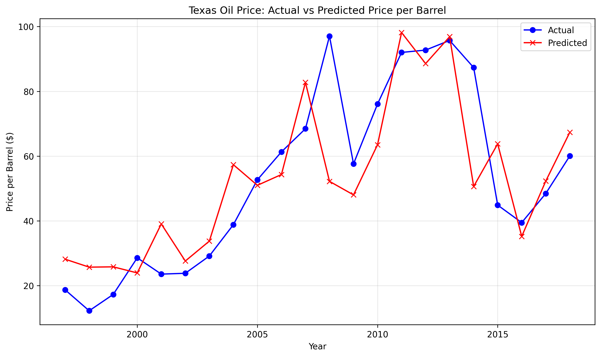
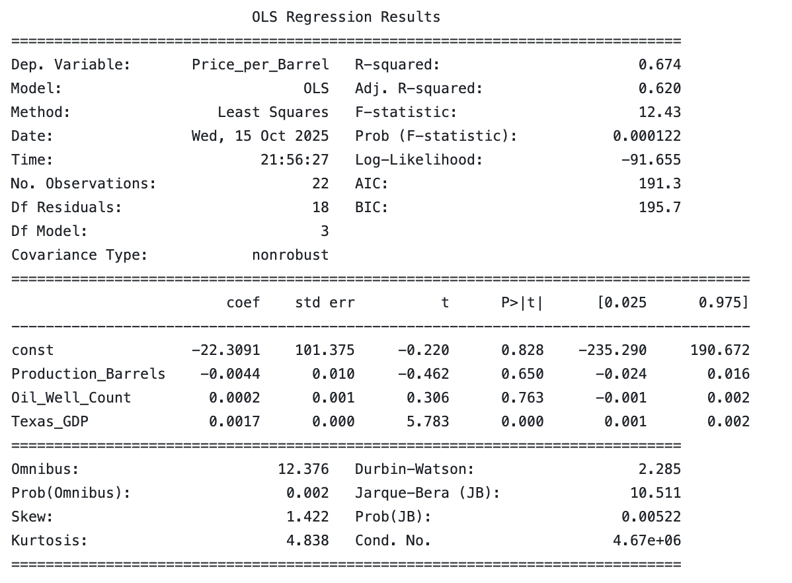

# Texas-Oil-Project
Oil Production Midterm Project

## Project Overview
This project investigates how **Texas oil prices** have impacted **Texas oil production** - measured by well counts and barrel production.  
We scarped data on our individual variables to create a combined dataset to study production trends, economic cycles and potential casual relationships between production activity and the broader economic preformance. 
We utilized regression analysis and a time-series technique to identify whether increases in oil output or well counts are associated with changes in oil prices.

### Research Questions
* How have Texas oil well counts and production levels evolved over time? 
* Is there a measurable relationship between oil production and oil prices?
* How does oil productivty or activity correlate with Texas GDP?  
* How responsive is Texas oil production to changes in price? 

## Data Sources
- **Well Counts** | Annual Texas oil well counts since 1935 | [Texas Railroad Commision](https://www.rrc.texas.gov/oil-and-gas/research-and-statistics/production-data/historical-production-data/crude-oil-production-and-well-counts-since-1935/)
- **Oil Production (Barrels)** | Monthly field production of crude oil in Texas | [US Energy Information Administration](https://www.eia.gov/dnav/pet/hist/LeafHandler.ashx?n=PET&s=MCRFPTX2&f=M)
- **Texas GDP** | Annual State GDP | [FRED - NGSP](https://fred.stlouisfed.org/graph/?g=hz8p)
- **Oil Prices** | Texas Crude Oil First Purchase Price (dollars per barrel) | [US Energy Information Administration](https://www.eia.gov/dnav/pet/hist/LeafHandler.ashx?n=PET&s=F003048__3&f=M)    
### Data Collection 
All data is stored in the '/code' folder. We cleaned and merged the datasets to ensure consistent:
- Units (thousand of barrels to barrels)
- Observation Frequency - inconsistent/missing years in data
- Date Alignment (time frequency) to ensure annual observations

## Methodology
We estimate the relationships through the regression model: y = x0 + (beta1)x1 + (beta2)x2 + (beta3)x3:

- where y is the average price of oil per barrel per year
- x0 is the slope coefficient
- x1 is the average production of barrels of oils per year
- x2 is the average number of oils well per year
- x3 is the GDP for the Texas Oil & Gas Industry in a given year

The regression is estimated by:
- Scraping all datasources and producing csv files for each datasource
- Cleaning the csv files by averaging monthly data for each year and converting all data points to integers
- Converting clean files to dataframes
- Running the regression model as listed above only against data values that overlap in years
- Running simple linear regression models of the y term on each of the x terms to isolate the individual relationship of each variable
- Plot the predicted values of oil prices using the estimated coefficients from the regression comparing it to the actual values of oil prices

## Regression Results 

## Analysis/ Discussion

### Limitations 
- Data frequency 
Our data is mainly annual, but monthly or quarterly could potentially better capture price production dynamics.
-  Omitted Variables
Oil prices are impacted by many other factors from outside of Texas, including global factors such as OPEC decisions.
- Regional Variation 
Oil activity varies widely across Texas. Using only state-level averages can potentially hide any important regional differences. 

### Next Steps (extensions)
1. Regional or County-Level Analysis:
    - Use county-level data to analyze any regional variation.
    - Examine if regions that are richer in Oil like Midland experience different price elasticities compared to less active regions. 
    - Look into more regional economic factors such as regional population.
2. Comparative Analysis:
    - Compare Texas to another major oil-producing state (e.g. New Mexico or North Dakota).
3. Corporate Analysis:
    - Explore data from major oil producers operating in Texas (e.g. ExxonMobil, Chevron, ConocoPhillips).
    - Examine firm-level production trends and whether they correlate with market prices.

## Reproduction
1. Clone the repository 
`git clone git@github.com:bradleyvance23/Texas-Oil-Project.git`
2. Install additional packages 
`pip install -r requirements`
3. Run data scraping and cleaning
`python code/main_scrape_file.py`
`python code/clean.py`
4. Execute analysis 
`python __`
5. View outputs  
`python`
